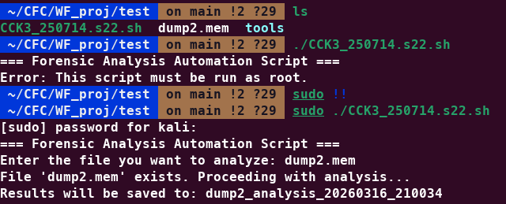
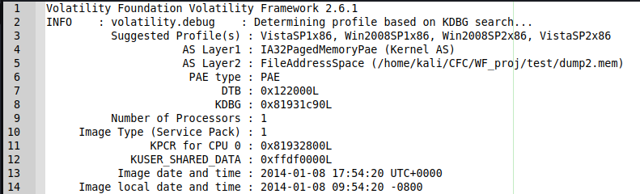
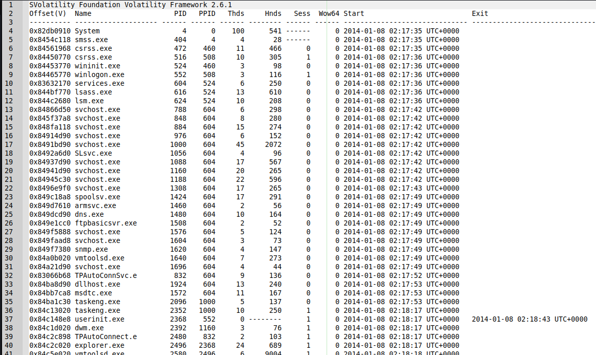
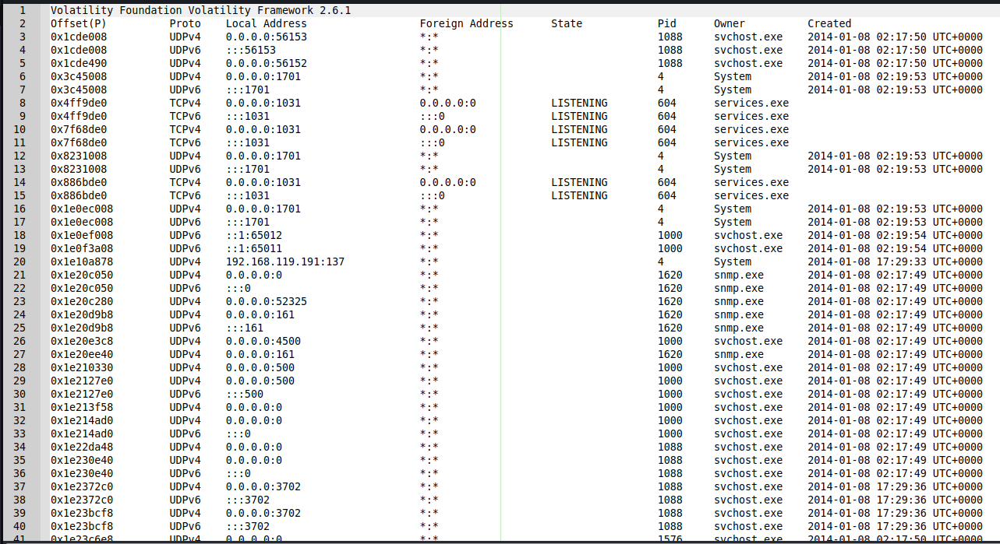
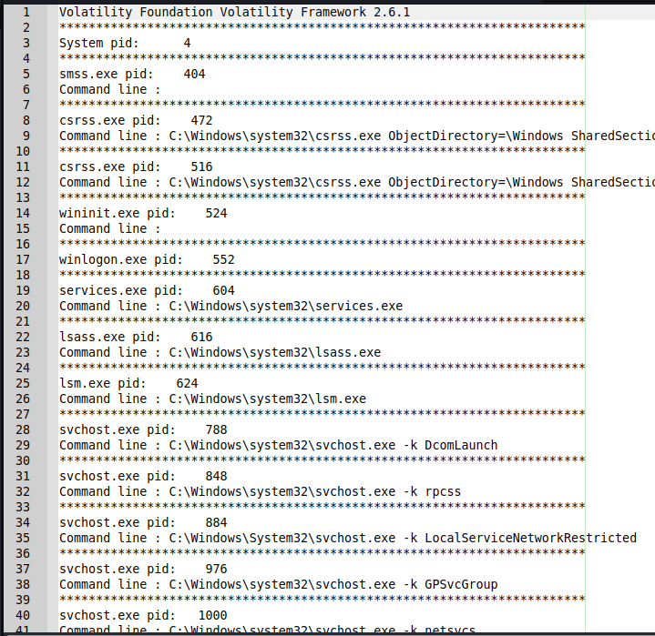
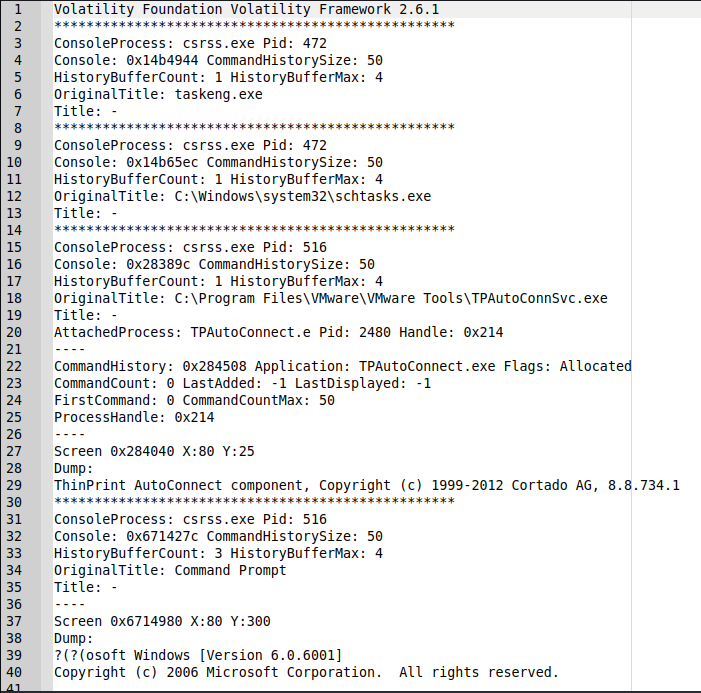
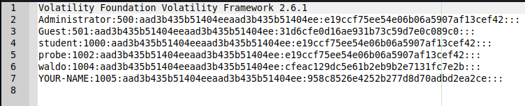
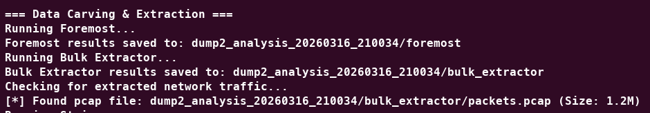
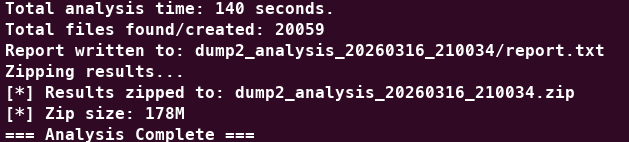

**Design and Development of an Automated Forensic Workflow for Memory and Disk Analysis Using Bash on Kali Linux**

***

Student Name: Tan Amos

Student Code: s22

Class Code: CCK3\_250714

Institute: Centre for Cybersecurity

Trainer: Samson

***

## 1. Introduction

Project Breach Trail is a digital forensics and incident response (DFIR) automation exercise focused on building a single Bash-based workflow that can process a forensic evidence file in Kali Linux and generate a structured case output. The goal of the project is to reduce repetitive manual work during memory and data carving analysis while still preserving analyst-readable results, reproducibility, and clear reporting.

The submitted script was designed to automate five major tasks:

*   memory analysis with **Volatility 2** and **Volatility 3**,

*   carving with **Foremost** and **Bulk Extractor**,

*   human-readable artifact hunting using **strings** and pattern matching,

*   result logging and report generation,

*   packaging of the completed case folder into a ZIP archive.

This report documents both the **intended workflow design** of the script and a **validated demonstration run** using the evidence file `dump2.mem`. The demonstration was performed against a suspected Windows memory image and the selected analysis path for that run was **Volatility 2**.



***

## 2. Project Objectives

The script was built to align with the project brief by performing the following core actions:

*   verify the script is run as `root`,

*   prompt for an input evidence file and validate that it exists,

*   check whether the required forensic tools are installed,

*   test whether the memory image is analyzable with Volatility,

*   extract memory artifacts such as processes, network connections, command history, DLL listings, hashes, registry-related outputs, and SIDs,

*   carve additional data automatically using multiple carving tools,

*   search for readable artifacts such as usernames, passwords, emails, IP addresses, executables, DLLs, and suspicious strings,

*   save results into a case directory,

*   produce a report and results inventory,

*   compress the final case output into a ZIP archive.

***

## 3. Environment, Evidence, and Tools

### 3.1 Analysis Environment

*   **Operating System:** Kali Linux

*   **Primary automation language:** Bash

*   **Main script:** `CCK3_250714.s22.sh`

*   **Evidence used in validated run:** `dump2.mem`

*   **Evidence type:** suspected Windows memory image

*   **Input size:** 536,870,912 bytes (512 MB)

### 3.2 Forensic Tools Used

*   **Volatility 2**

*   **Volatility 3**

*   **Foremost**

*   **Bulk Extractor**

*   **strings**

*   Standard shell utilities including `grep`, `find`, `stat`, `wc`, and `zip`

### 3.3 Validated Demo Run Summary

| Item                                     | Observed Result                                 |
| ---------------------------------------- | ----------------------------------------------- |
| Input file                               | `dump2.mem`                                     |
| Case folder                              | `dump2_analysis_20260316_210034`                |
| Selected memory workflow                 | Volatility 2                                    |
| Volatility 2 suggested profile used      | `VistaSP1x86`                                   |
| Other candidate profiles                 | `Win2008SP1x86`, `Win2008SP2x86`, `VistaSP2x86` |
| Image timestamp recovered by `imageinfo` | 2014-01-08 17:54:20 UTC                         |
| Analysis duration                        | 140 seconds                                     |
| Total files created/found in case folder | 20,059                                          |
| Final ZIP archive                        | `dump2_analysis_20260316_210034.zip`            |
| Final ZIP size                           | 178M                                            |



***

## 4. Script Design and Workflow

### 4.1 Input Validation and Case Preparation

The script first checks whether it is being run as `root`. It then prompts the user to enter an evidence filename and keeps prompting until a valid file is supplied. Once the file is accepted, the script creates a timestamped case folder using the input filename and analysis time.

For the validated run, the case directory created was:

`dump2_analysis_20260316_210034`

Within this case folder, the script saves analysis outputs, carving results, strings results, registry hive dumps, report files, and the final packaged ZIP archive.

### 4.2 Tool Detection and Readiness Checks

Before analysis starts, the script checks whether the required tools are installed. It confirms the availability of `foremost`, `bulk_extractor`, and `strings`, and also attempts to detect working Volatility 2 and Volatility 3 launchers.

The memory image is then tested with Volatility pre-checks:

*   **Volatility 2:** `imageinfo`

*   **Volatility 3:** `windows.info`

In the validated run, both Volatility 2 and Volatility 3 pre-checks indicated that the image appeared analyzable. The demonstration then proceeded using **Volatility 2**.

### 4.3 Memory Analysis Path

The memory-analysis section of the script is designed to extract:

*   running processes,

*   network connections,

*   executed commands,

*   DLL listings,

*   hashes,

*   registry-related information,

*   SIDs.

For the Volatility 2 path, the script identifies a profile with `imageinfo`, stores it in a variable, and then runs:

*   `pslist`

*   `netscan` or `connscan` depending on profile suitability

*   `cmdline`

*   `cmdscan`

*   `consoles`

*   `dlllist`

*   `hivelist`

*   `hashdump`

*   `getsids`

*   `dumpregistry`

This design is important because some command-history evidence is stronger in `cmdline` or `consoles` than in `cmdscan`, and hash extraction requires locating the correct SYSTEM and SAM hive offsets before invoking `hashdump`.

### 4.4 Data Carving and Readable Artifact Hunting

After memory analysis, the script performs automated carving using:

*   **Foremost** for file-type based carving,

*   **Bulk Extractor** for broad feature extraction, carved artifacts, and potential network recovery.

The script then runs `strings` across the full input and filters the output into a second file that highlights likely artifacts of interest such as:

*   passwords and credential-like strings,

*   usernames and login-related terms,

*   email addresses,

*   IPv4 addresses,

*   Windows executables and DLLs,

*   other suspicious or investigation-relevant readable content.

### 4.5 Reporting and Packaging

At the end of the workflow, the script writes a structured `report.txt`, produces a detailed `results_inventory.txt`, records skips or warnings in `failures_skipped.txt`, and compresses the full case directory into a ZIP archive.

This makes the output suitable for both grading and analyst review because the user receives:

*   a readable report,

*   a detailed manifest of saved files,

*   a single packaged archive for submission or transfer.

***

## 5. Validated Execution Results

### 5.1 Volatility Profile Identification

The Volatility 2 `imageinfo` output suggested the following candidate profiles:

*   `VistaSP1x86`

*   `Win2008SP1x86`

*   `Win2008SP2x86`

*   `VistaSP2x86`

The script selected and used **`VistaSP1x86`** for the actual Volatility 2 analysis path.

### 5.2 Process Enumeration

The saved `pslist` output showed an active Windows system with core operating system and service processes present. Representative examples include:

*   `System`

*   `smss.exe`

*   `services.exe`

*   `lsass.exe`

*   `dns.exe`

*   `snmp.exe`

*   `ftpbasicsvr.exe`

*   `explorer.exe`

The process list indicates that the memory image belonged to a live Windows environment running multiple user and service components rather than a minimal or inactive memory state.



### 5.3 Network Connections

The `netscan` output recovered multiple listening ports and service bindings. Examples visible in the run output include:

*   **445/TCP**

*   **3389/TCP**

*   **53/TCP**

*   **21/TCP**

*   **8080/TCP**

*   **161/UDP**

*   **135/TCP**

The address **192.168.119.191** also appeared in the recovered network data, confirming that the image contained meaningful network state rather than only local process metadata.

These results support the conclusion that the memory image retained recoverable service exposure and network configuration information relevant to incident response and host profiling.



### 5.4 Command History and User Activity

The script attempted `cmdline`, `cmdscan`, and `consoles` to maximize the chance of recovering executed command artifacts.

In this run, the most useful evidence came from `cmdline` and `consoles`. The recovered console history showed interactive administrative commands such as:

*   `net user waldo qwerty`

*   `net user /?`

*   `net user waldo qwerty /add`

*   `net user YOUR-NAME letmein /add`

*   `net user waldo Apple123 /add`

*   `net user YOUR-NAME SuperSecret! /add`

This is significant because it demonstrates that the memory image preserved clear evidence of user-management activity, including account-creation attempts and successful additions from an administrator session.





### 5.5 Hashes, Registry Data, and SIDs

The script successfully recovered account hashes using `hashdump`. The output included hashes for the following accounts:

*   `Administrator`

*   `Guest`

*   `student`

*   `probe`

*   `waldo`

*   `YOUR-NAME`

This is a strong DFIR outcome because it confirms that the workflow can move beyond simple process listing and recover identity-related and credential-related artifacts from memory.

The script also dumped **13 registry hive files**, including key hives such as:

*   `SYSTEM`

*   `SAM`

*   `SOFTWARE`

*   `SECURITY`

*   `COMPONENTS`

*   `DEFAULT`

*   `BCD`

*   multiple `NTUSERDAT` hives

*   `UsrClassdat`

In addition, the script saved SIDs output to `vol2_getsids.txt`, allowing account-to-SID review as part of the case evidence.



***

## 6. Carving and Human-Readable Artifact Recovery

### 6.1 Foremost Results

The Foremost stage created **841 regular files**. Based on the run inventory, the main recovered file categories were:

*   **487 DLL files**

*   **128 EXE files**

*   **101 HTM files**

*   **47 GIF files**

*   **39 PNG files**

*   **24 BMP files**

*   **10 JPG files**

*   **4 AVI files**

This indicates that the memory image contained a meaningful quantity of recoverable Windows program and presentation artifacts.

### 6.2 Bulk Extractor Results

Bulk Extractor generated **19,183 regular files** in the case folder. Notable categories observed in the inventory included:

*   **11,190** **`evtx_carved`** **artifacts**

*   **4,456** **`ntfsmft_carved`** **artifacts**

*   **1,427** **`ntfsusn_carved`** **artifacts**

*   **916** **`winpe_carved`** **artifacts**

*   **571** **`ntfslogfile_carved`** **artifacts**

*   **560** **`ntfsindx_carved`** **artifacts**

The run also created a recovered network capture file:

*   `dump2_analysis_20260316_210034/bulk_extractor/packets.pcap`

*   size: **1.2M**

This is useful because the case package includes a discrete network artifact that can be examined later in Wireshark or another packet-analysis tool.



### 6.3 Strings and Filtered Readable Artifacts

The full strings output was written to `strings/all_strings.txt`, and the filtered investigation-focused output was written to `strings/strings_of_interest.txt`.

The validated run produced **60,096 strings-of-interest hits**. These hits included numerous readable references to:

*   `.exe` and `.dll` files,

*   usernames and user-management terms,

*   password and credential-related text,

*   IPv4 addresses,

*   email-like strings,

*   administrator-related terms.

The strings stage is useful for triage because it quickly surfaces likely human-meaningful artifacts without requiring the analyst to manually review the full raw strings output.

***

## 7. Output Structure and Case Deliverables

The validated run produced a case folder containing the main memory-analysis files, carving directories, strings outputs, registry hive dumps, and reporting files. A simplified view of the saved structure is shown below:

```plain text
Project case folder
└── dump2_analysis_20260316_210034/
    ├── report.txt
    ├── results_inventory.txt
    ├── failures_skipped.txt
    ├── vol2_imageinfo.txt
    ├── vol2_pslist.txt
    ├── vol2_netscan.txt
    ├── vol2_cmdline.txt
    ├── vol2_cmdscan.txt
    ├── vol2_consoles.txt
    ├── vol2_dlllist.txt
    ├── vol2_hivelist.txt
    ├── vol2_hashdump.txt
    ├── vol2_getsids.txt
    ├── vol2_dumpregistry_log.txt
    ├── registry_hives/
    ├── foremost/
    ├── bulk_extractor/
    └── strings/
```

### 7.1 Key Output Files

| Output                                   | Purpose                                              |
| ---------------------------------------- | ---------------------------------------------------- |
| `report.txt`                             | human-readable execution summary and case statistics |
| `results_inventory.txt`                  | file-by-file inventory of generated case outputs     |
| `failures_skipped.txt`                   | warnings and skipped items recorded during execution |
| `vol2_imageinfo.txt`                     | profile detection and image metadata                 |
| `vol2_pslist.txt`                        | recovered process list                               |
| `vol2_netscan.txt`                       | network connections and listening ports              |
| `vol2_cmdline.txt` / `vol2_consoles.txt` | command and console activity                         |
| `vol2_hashdump.txt`                      | extracted account hashes                             |
| `vol2_getsids.txt`                       | SID extraction output                                |
| `registry_hives/`                        | dumped registry hive files                           |
| `bulk_extractor/packets.pcap`            | recovered packet capture artifact                    |
| `strings/strings_of_interest.txt`        | filtered readable-artifact hits                      |

### 7.2 Recorded Skip / Warning State

Only one skip was recorded in the validated run:

*   `connscan` was skipped because `VistaSP1x86` is a profile where `netscan` is the profile-appropriate plugin.

This is a controlled and expected skip rather than an execution failure.



***

## 8. Discussion

The validated run shows that the script achieved the main purpose of Project Breach Trail: it converted a single input evidence file into a structured forensic case package with memory-analysis outputs, carved artifacts, readable-string triage, registry data, hashes, SIDs, and a compressed archive.

From an engineering perspective, the script is useful because it combines:

*   analyst-facing output previews,

*   automatically saved result files,

*   multiple complementary carving methods,

*   both Volatility 2 and Volatility 3 support in the design,

*   a final packaged deliverable suitable for submission or later review.

From an investigation perspective, the `dump2.mem` run was especially valuable because it recovered not only generic operating system artifacts, but also user-management command history, listening services, packet capture output, dumped registry hives, and local account hashes.

***

## 9. Conclusion

Project Breach Trail successfully demonstrates a Bash-based forensic workflow for Kali Linux that automates both memory analysis and data carving while preserving readable outputs for the analyst. In the validated run against `dump2.mem`, the workflow:

*   identified a workable Windows memory profile,

*   recovered processes, network state, command-history evidence, hashes, SIDs, and registry hives,

*   carved a large number of artifacts using Foremost and Bulk Extractor,

*   located a recoverable `packets.pcap` file,

*   generated a large filtered strings artifact set,

*   saved the full case into a structured directory,

*   produced a final ZIP archive for packaging and submission.

Overall, the script provides a practical and reproducible foundation for basic DFIR triage and aligns well with the core requirements of the project brief.

***

## 10. References

*   Volatility Foundation. *Volatility Command Reference*. <https://github.com/volatilityfoundation/volatility/wiki/command-reference>

*   Volatility 3 Documentation. <https://volatility3.readthedocs.io/en/latest/>

*   Bulk Extractor Wiki. <https://github.com/simsong/bulk_extractor/wiki>

*   Foremost. <https://foremost.sourceforge.net/>

***
